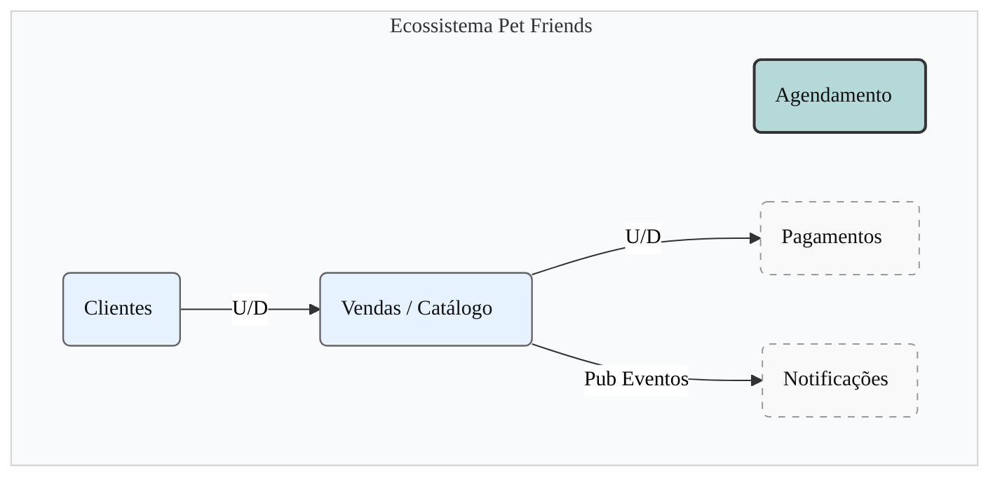
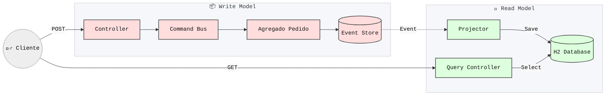
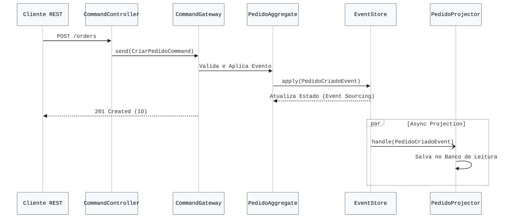

# 🐾 Pet Friends - Sales API


> **API de Vendas Escalonável para o Ecossistema Pet Friends**
>
> Implementação de referência utilizando arquitetura orientada a eventos, DDD, CQRS e Event Sourcing.

---

## 📖 Visão Geral

O módulo **Sales API** é responsável pelo ciclo de vida dos pedidos de venda na rede Pet Friends. Diferente de arquiteturas CRUD tradicionais, este projeto utiliza **Event Sourcing** para garantir auditabilidade total e **CQRS** (Command Query Responsibility Segregation) para escalar operações de leitura e escrita independentemente.

---

## 📚 Documentação Completa
Para detalhes profundos sobre as 12 questões arquiteturais e decisões de design, consulte o PDF oficial:
👉 **[Baixar Guia de Arquitetura (PDF)](docs/PetFriends_CQRS_Guide.pdf)**

---

### Mapa de Contexto

O serviço se situa no contexto de suporte a vendas, integrando-se com Pagamentos e Notificações dentro do ecossistema Pet Friends.



---

## 🏗️ Arquitetura

O projeto segue estritamente os princípios de **Domain-Driven Design (DDD)** e separa responsabilidades em:

1. **Core API**: Contrato puro (Comandos, Eventos, Queries).
2. **Command Side**: Agregados que protegem invariantes de negócio.
3. **Query Side**: Projeções otimizadas para leitura (Materialized Views).

#### Fluxo de Dados (CQRS)



#### Sequência de Criação de Pedido



---

## 🚀 Tecnologias

- **Linguagem**: Java 21
- **Framework**: Spring Boot 3.4.x
- **Arquitetura**: Axon Framework (Event Sourcing & CQRS)
- **Banco de Dados**: H2 (In-Memory para desenvolvimento)
- **Infraestrutura**: Docker (Axon Server)
- **Docs**: SpringDoc OpenAPI (Swagger UI)

---

## ⚙️ Como Executar

**Pré-requisitos**

- JDK 21+
- Maven 3.8+
- Docker (para o Axon Server)

1. **Inicie a Infraestrutura (Axon Server)**

O Axon Server é necessário para orquestrar comandos e armazenar eventos.

```bash
docker run -d --name axonserver -p 8024:8024 -p 8124:8124 axoniq/axonserver
```

_Acesse o Dashboard em: http://localhost:8024_

2. **Execute a Aplicação**

```bash
mvn spring-boot:run
```

3. **Documentação da API (Swagger)**

Com a aplicação rodando, acesse a interface interativa: 👉 **http://localhost:8080/swagger-ui/index.html**

---

## 📂 Estrutura do Projeto

A organização de pacotes reflete a intenção arquitetural:

```plaintext
br.com.petfriends.sales_api
├── coreapi          # 📦 O CONTRATO (Compartilhável)
│   ├── base         # Abstrações (BaseCommand, BaseEvent)
│   ├── commands     # Intenções (CriarPedidoCommand)
│   └── events       # Fatos (PedidoCriadoEvent)
│
├── command          # ✍️ O MODELO DE ESCRITA
│   ├── aggregates   # Regras de Negócio (PedidoAggregate)
│   └── services     # Orquestração
│
├── query            # 👓 O MODELO DE LEITURA
│   └── pedido       # Projeções, Repositórios e Event Handlers
│
└── controllers      # 🌐 ADAPTADORES REST
```

---

## 🧪 Testando via Terminal

Criar um novo pedido:

```bash
curl -X POST http://localhost:8080/orders \
   -H "Content-Type: application/json" \
   -d '{"clienteId": "cliente-badrobot", "valorTotal": 199.90}'
```

Listar todos os pedidos:

```bash
curl -X GET http://localhost:8080/orders
```

---

## 🤝 Contribuição

1. Faça um fork do projeto.
2. Crie sua feature branch (`git checkout -b feat/nova-feature`).
3. Siga o padrão **Conventional Commits**.
4. Abra um Pull Request.

**Pet Friends Engineering Team** © 2025
